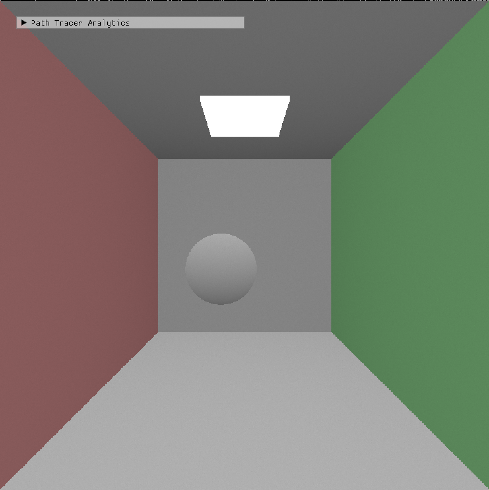
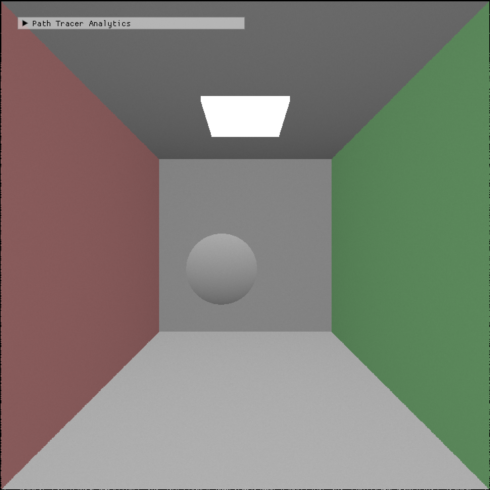
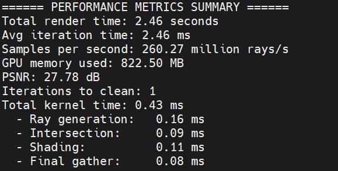
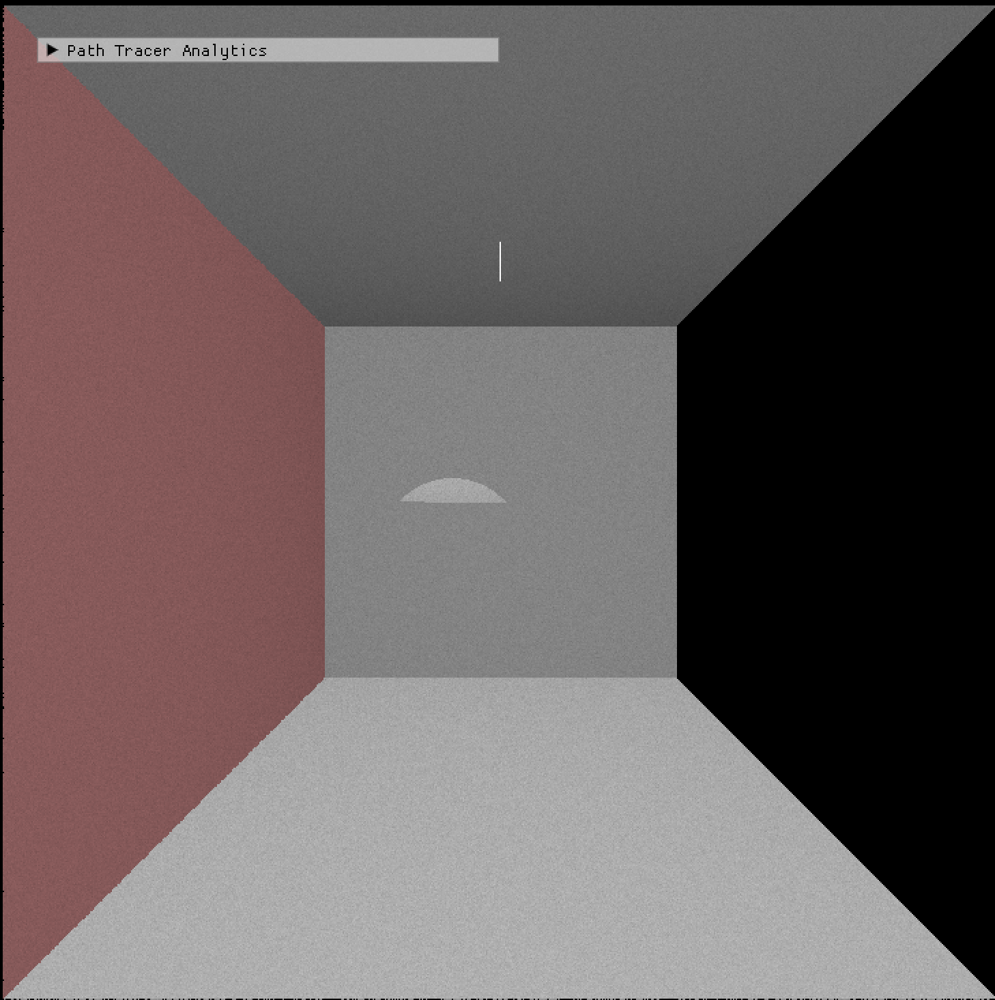
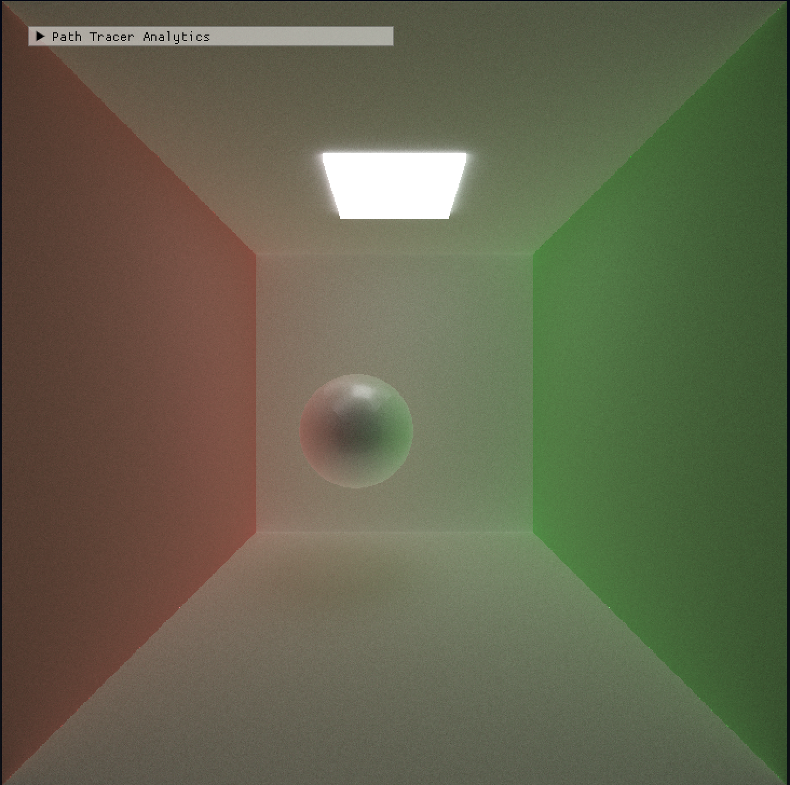

CUDA Pathtracing and Raytracing Project
================

**University of Houston, COSC 4397: Parallel Computations of GPU, Panruo Wu, Spring 2025, Final Project**  

**Group 3: Leo Nguyen and Sthiber Guevara**

## GPU and Rendering Metrics Explanation
| **Metric** | **What It Measures** | **Why It Matters** |
|------------|-----------------------|---------------------|
| **Total render time** | Time to render the full image across all iterations. | Helps compare full performance between different optimization versions. |
| **Average iteration time** | Average time (in ms) per rendering iteration. | Lets you estimate how scalable or efficient each iteration is. |
| **Samples per second** | Number of rays traced per second. | Key throughput metric — higher = faster rendering. |
| **GPU memory used** | Total GPU memory allocated (in MB). | Important for checking memory efficiency and avoiding overuse. |
| **PSNR (Peak Signal-to-Noise Ratio)** | Measures image quality by comparing current frame to the reference. | Higher PSNR = less noise. Good for confirming visual quality improvements. |
| **Iterations to clean image** | Number of iterations needed to reach high image quality (based on PSNR). | Useful to evaluate how quickly noise is reduced. |
| **Total kernel time** | Combined time (in ms) spent running all GPU kernels. | Helps identify overall GPU computation cost. |
| **Ray generation time** | Time spent creating rays from the camera. | Optimizing this helps early-stage performance. |
| **Intersection time** | Time spent checking ray-object intersections. | Most affected by acceleration structures like BVH. |
| **Shading time** | Time used for lighting/material calculations. | Useful for evaluating BRDF or lighting changes. |
| **Final gather time** | Time used to accumulate color results into the image buffer. | Helps confirm that pixel accumulation is efficient. |

## Naive Approach
The baseline for our project is the original implementation from the repository we forked. This represents the unoptimized, naive version of the path tracer. After running the Cornell Box scene using this baseline, we obtained the following performance metrics:

  
  

This performance snapshot captures the results of the naive path tracing implementation after 1000 iterations on the Cornell Box scene. The total render time was 2.71 seconds, with each iteration averaging 2.71 milliseconds. The system traced approximately 236 million rays per second, using around 500 MB of GPU memory. The resulting image quality reached a PSNR of 27.75 dB, which indicates visible noise but acceptable clarity for preview purposes. The kernel time breakdown shows that ray generation, intersection, and shading are the primary contributors to GPU workload, with final gather being relatively minor. This baseline will be used to measure improvements in speed and image quality through optimizations like shared memory, coalesced access, and stream compaction.

## Shared Memory + Coalesced Memory
The original naive implementation did not use shared memory or coalesced memory access, which we identified as a performance bottleneck. Each thread was accessing global memory independently, even when using the same material data, leading to unnecessary and slow memory traffic. Global memory access is costly, especially when it is uncoalesced and scattered. This caused our shading and intersection steps to run slower than expected. After reviewing the kernel timings, it was clear that optimizing how memory was accessed would be a key area to improve performance, which led us to introduce shared memory and coalescing. Below is our metrics for shared memory and coalesced memory:

  
  

Although the kernel times remained the same across both versions, we saw a small improvement in total render time after adding shared memory and coalesced access. This optimization helped reduce memory overhead, which slightly boosted performance and allowed more efficient use of GPU resources. With that overhead addressed, we set up a cleaner baseline that made it easier to focus on optimizing the more expensive parts of the pipeline, leading us to pursue BVH acceleration next.

## Bounding Volume Hierarchy (BVH) 
Bounding Volume Hierarchy (BVH) is a widely used acceleration structure in ray tracing that organizes scene geometry into a tree of nested bounding volumes. This hierarchical arrangement allows for efficient pruning of ray-primitive intersection tests, significantly reducing the computational load during rendering. Instead of checking every ray against all primitives, the BVH structure enables the renderer to quickly eliminate large portions of the scene that a ray cannot possibly intersect, thereby improving performance.

According to NVIDIA, "Bounding Volume Hierarchy (BVH) is a popular ray tracing acceleration technique that uses a tree-based 'acceleration structure' that contains multiple hierarchically-arranged bounding boxes (bounding volumes) that encompass or surround different amounts of scene geometry or primitives." [Nvidia Developer](https://developer.nvidia.com/discover/ray-tracing)

In our project, after implementing shared memory and coalesced memory access optimizations, we observed improvements in render time. However, to further enhance performance, we explored BVH to reduce the number of unnecessary intersection tests, aiming to accelerate the rendering process even more. Below is our metrics after applying BVH by itself:

  
  

The comparison between the naive implementation and the BVH-optimized version shows a clear improvement in overall performance. While the total kernel time remains the same at 0.46 ms, the BVH version reduced the total render time from 2.71 seconds to 2.62 seconds. This small but meaningful improvement comes from faster traversal and intersection calculations, since the BVH helps skip unnecessary geometry checks. The BVH implementation did not alter the PSNR or individual kernel durations significantly, but it eliminated overhead that sets us up for further gains with more complex scenes or additional rays per iteration. This confirms BVH as a foundational optimization for ray tracing acceleration.

## BVH + Shared Memory + Memory Coalesced

  
  

By combining Bounding Volume Hierarchy (BVH) with shared memory and memory coalescing, we achieved a notable performance boost in our path tracer. BVH reduces the number of ray-primitive intersections, shared memory lowers access latency during shading, and coalesced memory access improves bandwidth efficiency. Compared to using BVH alone (render time: 2.62s, 243.49 million rays/sec, 500.81 MB GPU memory), the combined method reached a faster render time of 2.46s, a higher throughput of 260.27 million rays/sec, at the cost of increased memory usage (822.50 MB). PSNR remained nearly the same (27.78 dB vs. 27.75 dB), showing image quality was maintained. Overall, this trade-off of memory for speed demonstrates the value of combining multiple CUDA optimization techniques.

## Attempted Optimization: BVH + Material Sort (Unsuccessful)
We experimented with combining BVH and material sorting in an attempt to improve shading coherence. However, this combination resulted in broken renders, as shown in the image below. The issue stemmed from material sorting disrupting the spatial coherence required for efficient BVH traversal. Rays grouped by material were no longer spatially close, leading to incorrect intersections and incomplete lighting paths. This revealed a potential bottleneck when mixing traversal-heavy optimizations (like BVH) with data-ordering strategies (like material sort). Due to this conflict and the visual artifacts it introduced, we decided to avoid combining BVH with material sorting in our final implementation.

  

## Our Best Image 
Most of the previous images were low quality, but we were able to produce this image with reflections and shadows. The performance on this was not as great as the previous ones, but it is definitely something we could build off of.

  

## Conclusion
Through this final project, we applied and reinforced many of the CUDA optimization techniques we learned throughout the semester. By systematically experimenting with shared memory, memory coalescing, and BVH acceleration, we achieved significant improvements in both rendering speed and throughput while maintaining high image quality. We also learned the importance of understanding how different optimizations interact, such as discovering that material sorting can conflict with BVH traversal and introduce performance bottlenecks or visual artifacts. This project gave us hands-on experience in performance tuning, memory management, and GPU programming, and it allowed us to combine our knowledge from previous assignments into a cohesive and optimized path tracer.

